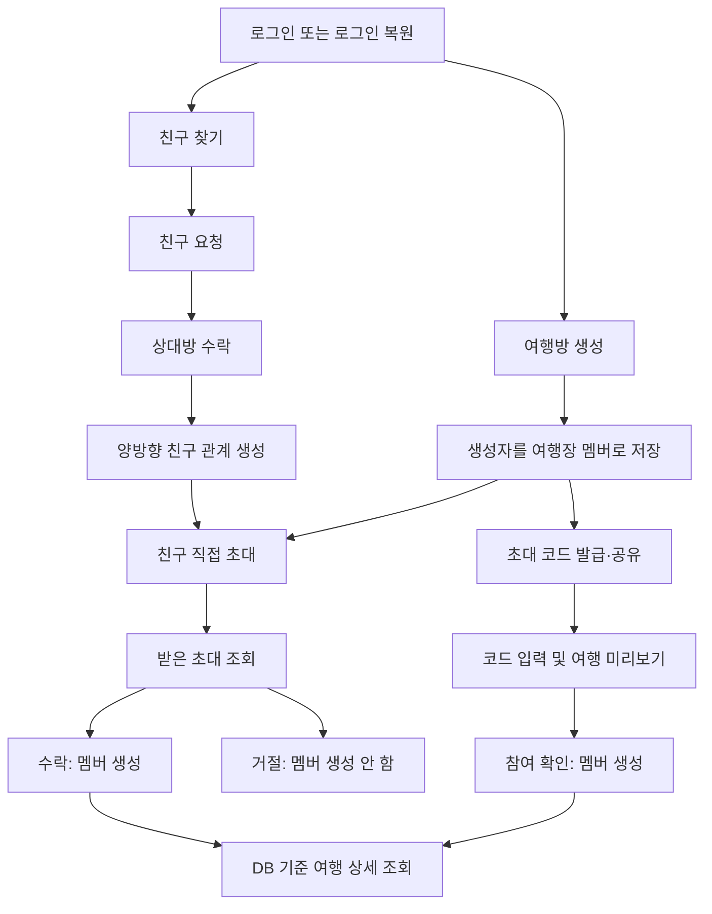

# 여행방 생성 및 친구 초대·가입 명세서

작성일: 2026-09-24 · 상태: 구현 전 제안 명세 v1

이 문서는 현재 프론트엔드와 USER/Auth API를 기준으로 작성한 **구현 목표**다. 아래 여행·친구 서버 API와 테이블이 이미 구현되었다는 뜻은 아니다. ‘친구 가입’은 서비스 회원가입과 구분하여 **친구 관계 맺기**와 **친구의 여행방 참여**를 모두 포함한다.

## 1. 범위와 현재 상태

현재 서버는 USER/Auth API를 제공한다. 프론트엔드의 여행 생성·친구 추가·초대 코드 참여는 `applyCommand()`로 로컬 Workspace를 수정한다. HTTP 로그인 모드에서도 여행 데이터는 계정별 기기 저장소에 있어 다른 회원·기기와 공유되지 않는다.

### 1차 구현 범위

- 등록된 회원 찾기, 친구 요청·수락·거절·취소, 친구 목록·관계 삭제
- 여행방 생성, 내 여행 목록, 여행방 상세·멤버 조회, 여행 기본 정보 수정·보관
- 친구 직접 초대, 받은 초대 조회·수락·거절, 초대 취소
- 초대 코드 발급·교체·폐기, 코드 미리보기·참여
- 서버 인증·권한 검사, DB 영속화, 중복·동시 요청 처리, 프론트 연결

### 후속 범위

- 일정·장소·팀·정산·준비물·공지·채팅의 서버 CRUD 및 실시간 동기화
- 푸시 발송, 이메일 초대, 미가입자의 자동 초대 예약, 연락처 가져오기
- 멤버 추방·자진 탈퇴·여행장 위임·여행방 영구 삭제
- 차단·신고 및 상세 운영 정책

초대 목록 API로 초대를 확인할 수 있어야 하며, 푸시 알림 구현 여부가 가입 성공을 좌우하지 않는다.

## 2. 기본 정책

다음은 구현을 위한 제안 기본값이며 제품 정책 확정 시 변경할 수 있다.

| 항목 | 제안 기본값 |
| --- | --- |
| 여행장 | 생성한 회원 1명. 서버가 인증 정보로 지정 |
| 여행 기간 | 출발일·종료일 포함 1~90일. 과거 여행 기록 생성도 허용 |
| 이름·목적지 | 앞뒤 공백 제거 후 각각 1~100자 |
| 총 예산 | 원 단위 정수, 0~1,000,000,000. 0은 미정 |
| 최대 멤버 | 여행장 포함 30명. 대기 초대는 자리 예약하지 않음 |
| 직접 초대 | 여행장이 수락 완료된 친구에게 발송. 수신자 수락 후 멤버가 됨 |
| 초대 코드 | 친구 관계가 없어도 로그인한 회원이 명시적으로 참여 가능 |
| 초대 유효기간 | 직접 초대·초대 코드 모두 발급 후 7일 |
| 여행방 상태 | ACTIVE / ARCHIVED. 보관 상태에서는 조회만 허용 |
| 재개 | 여행장이 ARCHIVED → ACTIVE 변경 가능. 이전 초대는 복원하지 않음 |
| 친구 관계 | 양방향. 친구 수락과 여행방 가입은 서로 독립 |

친구를 삭제해도 이미 가입한 여행방에서 자동 퇴장시키지 않는다. 발송된 직접 초대도 취소 전까지 유효하며, 친구 여부는 발송 시 검사한다. 가입만으로 자동 친구가 되지는 않는다.

## 3. 전체 파이프라인



### 여행방 생성

1. 로그인한 사용자가 여행 이름·목적지·날짜·예산을 입력한다.
2. 서버가 값을 검증하고 ACTIVE 여행방을 생성한다.
3. 생성자의 OWNER 멤버십을 같은 트랜잭션에서 생성한다.
4. `inviteeIds`가 있으면 각 대상의 친구 관계를 검증하고 PENDING 초대를 생성한다.
5. 선택한 대상 중 하나라도 유효하지 않으면 여행방·멤버·초대 생성을 모두 롤백한다.
6. 응답의 `trip.id`로 여행 상세 화면을 연다. 초대받은 친구는 수락 전에는 멤버 목록에 포함하지 않는다.

### 초대 수락·코드 참여

1. 직접 초대는 지정된 수신자만 수락한다. 코드는 유효한 코드를 가진 로그인 회원이 참여한다.
2. 서버가 계정 상태, 초대 만료·취소 여부, 여행 상태, 현재 멤버십과 정원을 확인한다.
3. 여행방 행을 잠근 상태에서 정원을 다시 확인하고 MEMBER 멤버십을 생성한다.
4. 직접 초대 수락이면 초대를 ACCEPTED로 변경한다. 코드로 들어온 회원에게 대기 중인 직접 초대가 있으면 함께 ACCEPTED 처리한다.
5. 응답을 받은 프론트가 여행 상세·멤버 목록을 새로 조회한다.

## 4. 공통 API 규칙

- 기준 경로: `/api/v1`. 모든 아래 API에 `Authorization: Bearer <accessToken>`이 필요하다.
- 기존 Auth와 동일하게 JWT 서명·만료·issuer·audience, 회원 ACTIVE 상태, tokenVersion을 검사한다.
- 요청자의 ID는 JWT에서 결정한다. `ownerId`, `requesterId`, `role`을 본문으로 받지 않는다.
- JSON 필드명은 camelCase, ID는 문자열, 시각은 UTC ISO8601, 여행 날짜는 `YYYY-MM-DD`다.
- 성공: `{ "code": "SUCCESS", "data": ... }`. 실패: `{ "code": "오류코드", "message": "설명" }`.
- 미지원 필드·잘못된 타입·빈 PATCH를 거절한다. 선택 필드 생략과 null의 의미를 개별 정의한다.
- 목록: `data.items`, `data.nextCursor`. 기본 limit 20, 최대 100. 불투명 cursor 사용.
- 여행 목록은 createdAt DESC, id DESC. 초대·친구 요청 목록도 동일하다. 멤버는 joinedAt ASC, id ASC.
- 비멤버가 여행 ID를 추측하면 404로 응답한다. 멤버이지만 여행장 전용 동작을 요청하면 403이다.

친구/멤버 공개 프로필은 `{id, name}`으로 제한한다. 다른 회원의 전체 프로필·계좌·기기 토큰을 반환하지 않는다. 기존 `/users/me` 응답을 다른 회원에게 재사용하지 않는다.

## 5. 친구 API

초기 버전의 회원 찾기는 **이메일 정확 일치**만 지원한다. 전체 회원 목록이나 이름 부분 검색은 제공하지 않는다. 입력 이메일은 가입 정책과 동일하게 정규화한다. 계정 존재 여부를 알아낼 수 있는 기능이므로 회원별 요청 제한을 적용한다.

| 메서드·경로 | 요청 | 응답·권한 |
| --- | --- | --- |
| POST /users/lookup | `{email}` | 200 `{user: {id,name} 또는 null}`. 본인·비활성 회원은 null |
| GET /friends | cursor, limit | 수락된 친구 목록. 항목 `{user:{id,name}, friendsSince}` |
| POST /friend-requests | `{recipientId}` | 신규 201. `{id,requester,recipient,status,createdAt}` |
| GET /friend-requests | direction=received/sent, status=PENDING, cursor, limit | 자신이 송신·수신한 요청만 조회 |
| POST /friend-requests/{id}/accept | 본문 없음 | 수신자만. 200 `{requestId,status:"ACCEPTED",friend:{id,name}}` |
| POST /friend-requests/{id}/decline | 본문 없음 | 수신자만. 200 `{requestId,status:"DECLINED"}` |
| POST /friend-requests/{id}/cancel | 본문 없음 | 송신자만. 200 `{requestId,status:"CANCELLED"}` |
| DELETE /friends/{userId} | 본문 없음 | 본인과 상대의 양방향 관계 삭제. 200 data:null |

친구 요청은 PENDING → ACCEPTED / DECLINED / CANCELLED로 전이한다. 동일한 최종 동작을 반복하면 200으로 기존 결과를 반환하고, 반대 결정을 뒤늦게 요청하면 409다. 상태 전이가 끝난 요청은 재사용하지 않는다.

자기 자신에게 요청은 400, 이미 친구면 409 `ALREADY_FRIENDS`다. 두 회원 사이에 어느 방향으로든 PENDING 요청이 있으면 새 요청을 만들지 않고 200으로 기존 요청을 반환한다. 반대 방향의 요청을 발견했다고 자동 수락하지 않는다. 이미 삭제된 친구 관계를 다시 삭제하는 요청은 200으로 처리한다.

## 6. 여행방 API

| 메서드·경로 | 기능 | 권한·결과 |
| --- | --- | --- |
| POST /trips | 여행방 생성 | 로그인 회원. 201 |
| GET /trips | 내 여행 목록 | 현재 멤버인 여행만. status=ACTIVE/ARCHIVED/ALL, 기본 ACTIVE |
| GET /trips/{tripId} | 상세 조회 | 멤버. 200 TripDetail |
| PATCH /trips/{tripId} | 기본 정보·보관 상태 수정 | 여행장. 200 TripDetail |
| GET /trips/{tripId}/members | 멤버 목록 | 멤버. 200 목록 |

### 생성 요청

```http
POST /api/v1/trips
Authorization: Bearer <accessToken>
Content-Type: application/json
Idempotency-Key: <클라이언트가 생성한 UUID>
```

```json
{
  "title": "부산 주말 여행",
  "destination": "부산",
  "startDate": "2026-10-10",
  "endDate": "2026-10-12",
  "budget": 600000,
  "inviteeIds": ["21", "22"]
}
```

`inviteeIds`는 생략 시 빈 배열이며 중복·본인 ID·친구가 아닌 ID를 거절한다. 한 번에 최대 29명을 초대한다. 예산은 필수 숫자이며 빈 문자열을 서버가 0으로 바꾸지 않는다.

### 생성 응답 예시

```json
{
  "code": "SUCCESS",
  "data": {
    "trip": {
      "id": "100",
      "title": "부산 주말 여행",
      "destination": "부산",
      "startDate": "2026-10-10",
      "endDate": "2026-10-12",
      "budget": 600000,
      "status": "ACTIVE",
      "owner": {"id": "15", "name": "여행장"},
      "memberCount": 1,
      "maxMembers": 30,
      "myRole": "OWNER",
      "version": 0,
      "createdAt": "2026-09-24T03:00:00Z",
      "updatedAt": "2026-09-24T03:00:00Z"
    },
    "invitations": [
      {"id": "501", "inviteeId": "21", "status": "PENDING", "expiresAt": "2026-10-01T03:00:00Z"},
      {"id": "502", "inviteeId": "22", "status": "PENDING", "expiresAt": "2026-10-01T03:00:00Z"}
    ]
  }
}
```

TripDetail은 위 `trip` 구조다. 여행 목록도 같은 구조의 항목을 반환하며 일정·채팅 등 전체 하위 데이터를 끼워 넣지 않는다. 멤버 항목은 `{user:{id,name},role,joinedAt}`이다. 목록·상세에 초대 코드 원문을 포함하지 않는다.

### 수정·보관

PATCH 허용 필드: `title`, `destination`, `startDate`, `endDate`, `budget`, `status`, `version`.

- `version`은 필수이며 실제 변경 필드를 1개 이상 보낸다. null은 허용하지 않는다.
- 생략한 필드는 유지한다. 변경 후 전체 날짜·예산 규칙을 재검증한다.
- 현재 버전과 다르면 409 `VERSION_CONFLICT`. 성공 시 version을 증가시킨다.
- ARCHIVED로 바꾸면 PENDING 초대와 활성 초대 코드를 같은 트랜잭션에서 취소한다.
- ARCHIVED에서는 `{status:"ACTIVE",version}`으로 재개하는 동작만 허용한다. 재개 후 새 초대를 발급한다.
- 후속 일정 API 도입 시 여행 기간을 줄이는 변경이 기존 일정·팀 활동 날짜를 제외하면 거절해야 한다.

## 7. 친구 직접 초대 API

| 메서드·경로 | 요청 | 응답·권한 |
| --- | --- | --- |
| POST /trips/{tripId}/invitations | `{inviteeId}` | 여행장이 친구에게 발송. 신규 201, 기존 유효 PENDING이면 200 |
| GET /trips/{tripId}/invitations | status=PENDING, cursor, limit | 여행장만 송신 내역 조회 |
| GET /users/me/trip-invitations | status=PENDING, cursor, limit | 본인 수신 내역 조회 |
| POST /trip-invitations/{id}/accept | 본문 없음 | 수신자만 가입. 200 `{tripId,status:"ACCEPTED",membership:{userId,role,joinedAt}}` |
| POST /trip-invitations/{id}/decline | 본문 없음 | 수신자만. 200 `{id,status:"DECLINED"}` |
| POST /trip-invitations/{id}/cancel | 본문 없음 | 해당 여행장만. 200 `{id,status:"CANCELLED"}` |

초대 항목은 `{id,trip:{id,title,destination,startDate,endDate},inviter:{id,name},invitee:{id,name},status,createdAt,expiresAt,respondedAt}`다. 수락 전에는 이 제한된 여행 요약만 볼 수 있고 여행 상세·멤버·계좌·정산에는 접근할 수 없다.

상태: PENDING → ACCEPTED / DECLINED / CANCELLED / EXPIRED. 만료는 요청 처리 시 현재 시각으로 반드시 확인하며 배치 작업 실행 여부에 의존하지 않는다.

- 이미 멤버에게 새 초대 발송: 409 `ALREADY_TRIP_MEMBER`.
- 동일 초대의 수락 재시도: 멤버십이 유지된다면 200, 추가 멤버 생성 없음.
- 이미 멤버인 사람이 유효한 대기 초대를 수락: 기존 멤버십 반환 후 ACCEPTED 처리.
- 유효한 초대의 정원 초과: 409 `TRIP_FULL`, 초대는 PENDING 유지.
- 취소·거절된 초대 수락: 409 `INVITATION_NOT_PENDING`. 만료 수락: 410 `INVITATION_EXPIRED`.
- 본인에게 속하지 않은 초대 ID: 404. 만료된 초대를 다시 발송할 때는 새 ID로 생성한다.

## 8. 초대 코드 API

| 메서드·경로 | 요청 | 동작 |
| --- | --- | --- |
| POST /trips/{tripId}/invite-code | 본문 없음 | 여행장만. 새 코드 발급 및 기존 코드 폐기. 201 `{code,expiresAt}` |
| DELETE /trips/{tripId}/invite-code | 본문 없음 | 여행장만. 활성 코드 폐기, 없으면 그대로 성공. 200 data:null |
| POST /trip-join/preview | `{code}` | 유효 코드의 여행 요약 확인. 200 `{trip:{id,title,destination,startDate,endDate},memberCount,maxMembers,alreadyMember}` |
| POST /trip-join | `{code}` | 본인이 참여 확정. 신규 201, 이미 멤버면 200. `{tripId,membership:{userId,role,joinedAt}}` |

코드는 서버의 보안 난수 생성기로 생성한 **26자리 Base32 문자열(최소 128비트 난수)**을 사용한다. 입력은 앞뒤 공백 제거 후 대문자로 정규화한다. 임의의 내부 공백·다른 문자는 거절한다. 현재 프론트의 Math.random 기반 짧은 코드는 서버 인증 수단으로 사용하지 않는다.

DB에는 코드의 SHA-256 digest만 저장하고 원문은 발급 응답에서 한 번만 반환한다. 원문 재조회 API는 없다. 화면을 닫아 코드를 잃으면 ‘새 초대 코드 발급’으로 교체한다. 코드 교체는 해당 여행의 모든 기존 코드를 무효화하지만 직접 초대는 유지한다.

미리보기는 가입하지 않는다. 비로그인 사용자는 로그인 후 다시 코드를 제출하고 ‘참여하기’를 눌러야 한다. 유효하지 않거나 만료·폐기된 코드에는 공통 404 `INVALID_INVITE_CODE`를 반환한다. 유효한 코드라도 정원이 차면 참여는 409다. 코드를 공유하면 제3자가 가입할 수 있다는 안내를 여행장에게 표시한다.

## 9. 권한 요약

| 동작 | 여행장 | 일반 멤버 | 초대받은 비멤버 | 기타 회원 |
| --- | --- | --- | --- | --- |
| 여행 상세·멤버 조회 | 가능 | 가능 | 불가 | 불가 |
| 여행 수정·보관·재개 | 가능 | 불가 | 불가 | 불가 |
| 친구 직접 초대·코드 발급 | 가능 | 불가 | 불가 | 불가 |
| 받은 초대 요약·수락·거절 | 본인 수신 건만 | 본인 수신 건만 | 본인 수신 건만 | 본인 수신 건만 |
| 코드 미리보기·참여 | 유효 코드 필요 | 유효 코드 필요 | 유효 코드 필요 | 유효 코드 필요 |

버튼 숨김은 편의 기능이며 모든 권한은 서버에서 재검증한다. 새 `/trips/**`, `/friends/**`, `/friend-requests/**`, `/trip-invitations/**`, `/trip-join/**` 경로도 인증용 SecurityFilterChain에 포함해야 한다. 현재 기존 경로용 permitAll 체인에 흘러가도록 두지 않는다.

## 10. 논리 DB 모델

아래는 제안 모델이다. 기존 실제 DB의 테이블·키·외래키를 조사한 뒤 충돌 없이 매핑하는 마이그레이션을 작성한다. 기존 테이블을 삭제하거나 ddl-auto=update로 임의 변경하지 않는다.

| 테이블 | 핵심 컬럼 | 제약·인덱스 |
| --- | --- | --- |
| trip | id, owner_id, title, destination, start_date, end_date, budget, status, max_members, version, created_at, updated_at | owner_id FK user, 상태·생성 시각 인덱스 |
| trip_member | id, trip_id, user_id, joined_at | UNIQUE(trip_id,user_id), (user_id,trip_id) 인덱스 |
| trip_invitation | id, trip_id, inviter_id, invitee_id, status, expires_at, responded_at, created_at | 수신자·상태·생성 시각 인덱스, 활성 대기 초대 중복 방지 |
| trip_invite_code | id, trip_id, digest, expires_at, revoked_at, created_at | UNIQUE(digest), 여행별 활성 코드 조회 인덱스 |
| friendship | id, user_low_id, user_high_id, created_at | 두 ID를 정렬해 저장, UNIQUE(user_low_id,user_high_id), self 관계 금지 |
| friend_request | id, requester_id, recipient_id, user_low_id, user_high_id, status, responded_at, created_at | 방향 무관 PENDING 중복 방지, 송신·수신 조회 인덱스 |
| api_idempotency | id, user_id, operation, request_key, request_digest, response_status, response_body, expires_at | UNIQUE(user_id,operation,request_key) |

멤버의 OWNER/MEMBER는 `trip.owner_id == trip_member.user_id`로 계산한다. 별도 역할 컬럼을 중복 저장하지 않아 여행장 정보 불일치를 방지한다. 여행장도 항상 멤버 행을 가진다. budget은 DB BIGINT로 저장한다.

MySQL에서는 PENDING일 때만 값이 생기는 생성 컬럼에 UNIQUE를 걸어 여행별·수신자별 초대 중복과 친구 쌍의 요청 중복을 방지할 수 있다. EXPIRED 처리는 시간 기반 생성 컬럼에 맡기지 않고 요청 트랜잭션에서 기존 PENDING 상태를 종료한 뒤 새 행을 만든다.

## 11. 트랜잭션·동시성·재시도

- 여행 생성: trip + 생성자 trip_member + 선택 대상 trip_invitation + 멱등 응답 저장을 한 트랜잭션으로 처리한다.
- 친구 수락: 요청 상태 변경과 정규화된 friendship INSERT가 원자적이어야 한다.
- 정원 확인과 멤버 INSERT: trip 행의 쓰기 잠금을 사용한다. 초대/코드도 최신 상태를 잠금 조회하여 취소·보관·교체와의 경합을 직렬화한다.
- 코드 교체·보관과 참여는 동일한 trip 잠금 순서를 사용한다. 회원 상태 변경과의 경합도 고려하여 구현 시 ‘회원 ID 오름차순 → trip → 초대/코드’ 순서를 통일한다.
- 마지막 한 자리에 두 사용자가 동시에 가입해도 한 요청만 성공해야 한다. DB UNIQUE가 같은 사용자의 중복 가입을 최종 방어한다.
- MySQL REPEATABLE READ에서 잠금 전 조회한 멤버/정원 캐시를 그대로 믿지 않는다. 잠금 획득 후 현재 읽기로 다시 판단한다.

`POST /trips`에는 Idempotency-Key를 필수로 받는다. 보존 기간은 24시간으로 제안한다. 같은 회원·작업·키·정규화된 요청 본문이면 최초 status/body를 반환한다. 같은 키에 다른 본문은 409 `IDEMPOTENCY_KEY_REUSED`다. 프론트는 응답 유실 재시도 때 같은 키를 유지하고 입력을 바꾼 새 생성 작업에는 새 키를 발급한다. 성공 응답만 저장하고 실패 트랜잭션은 롤백한다.

그 외 가입·친구 요청은 위 상태/UNIQUE 규칙으로 재시도를 처리한다. 코드 발급을 재시도하면 새 코드로 교체될 수 있다는 점은 별도 안내한다.

## 12. 오류·입력 제한

| HTTP | code | 의미 |
| --- | --- | --- |
| 400 | INVALID_REQUEST | 타입·필수 필드·형식·지원하지 않는 필드 오류 |
| 400 | INVALID_TRIP_DATES | 잘못된 날짜, 종료일 역전, 90일 초과 |
| 400 | INVITEE_NOT_FRIEND | 초대 대상이 수락 완료된 친구가 아님 |
| 401 | UNAUTHORIZED | 인증 토큰 없음·만료·무효화 |
| 403 | ACCOUNT_UNAVAILABLE | 비활성 계정 |
| 403 | TRIP_OWNER_REQUIRED | 멤버이나 여행장 전용 기능 요청 |
| 404 | TRIP_NOT_FOUND / INVITATION_NOT_FOUND | 없거나 접근할 수 없는 리소스 |
| 404 | INVALID_INVITE_CODE | 존재하지 않거나 만료·폐기된 코드 |
| 409 | ALREADY_FRIENDS / ALREADY_TRIP_MEMBER | 이미 연결된 대상 |
| 409 | REQUEST_NOT_PENDING / INVITATION_NOT_PENDING | 이미 다른 상태로 처리됨 |
| 409 | TRIP_FULL / TRIP_ARCHIVED | 정원 초과 / 보관된 여행 변경 시도 |
| 409 | VERSION_CONFLICT / IDEMPOTENCY_KEY_REUSED | 수정 충돌 / 생성 재시도 키 오용 |
| 410 | INVITATION_EXPIRED | 본인에게 발송된 직접 초대 만료 |
| 429 | TOO_MANY_REQUESTS | 검색·요청·코드 시도 제한 초과 |

검색·코드 시도는 회원 및 IP 기준 분당 10회, 친구/여행 초대 발송은 회원 기준 시간당 30회로 제안한다. 실제 배포에서는 여러 서버 인스턴스가 공유하는 제한 저장소를 사용한다. 초대 코드·Authorization·비밀번호·FCM 토큰을 로그에 남기지 않는다.

## 13. 회원 탈퇴와 상태 일관성

기존 USER 탈퇴 API에도 새 관계 정리가 필요하다.

- 다른 멤버가 있는 ACTIVE 여행의 여행장은 탈퇴를 거절하고 먼저 여행을 보관하도록 안내한다: 409 `ACTIVE_TRIP_OWNER`.
- 혼자 있는 ACTIVE 여행은 탈퇴와 함께 보관한다. 보관된 여행은 다른 기존 멤버에게 조회만 허용하며 재개할 수 없는 경우 UI에 표시한다.
- 일반 멤버 탈퇴 시 해당 멤버십과 친구 관계를 삭제하고 관련 요청·초대 이력을 삭제한다.
- 탈퇴한 회원의 user 행은 실제 삭제한다. 여행의 owner_id는 NULL로 해제하며 응답의 owner는 빈 id와 ‘탈퇴한 사용자’ 이름으로 표시한다.
- 여행장 탈퇴 시 초대 코드를 폐기한다. 탈퇴 처리와 가입 요청은 동일 잠금 규칙을 사용한다.
- 향후 정산/메시지 서버 모델이 생기면 과거 작성자·정산 책임 보존 정책을 추가해야 한다.

## 14. 프론트 연결

| 현재 구현 | 변경 목표 |
| --- | --- |
| 친구 화면의 로컬 이름/이메일 검색 | 서버 이메일 검색 + 친구 요청 버튼 + 받은/보낸 요청 탭 |
| friend.add 즉시 양방향 추가 | 친구 요청 및 수락 API 후 목록 재조회 |
| 생성 입력 memberIds | inviteeIds로 전달. 화면에 ‘초대할 친구’라고 명시 |
| trip.create의 Workspace 통째 반환 | 생성 응답의 trip.id를 사용해 이동 |
| trip.invite의 즉시 멤버 추가 | PENDING 초대 생성 및 초대 상태 표시 |
| trip.join의 로컬 코드 비교 | 서버 미리보기 → 참여 확인 → 가입 API |
| data.trips 전체 로컬 조회 | 내 여행 목록·여행 상세·멤버 API 별도 조회 |
| inviteCode를 여행 상세에 항상 표시 | 여행장 전용 발급·교체 화면에서 원문 일회 표시 |

HTTP 모드에서 여행방·멤버십·친구 관계의 기준은 서버 DB다. 신규 서버 여행을 로컬 `applyCommand()`만으로 수정하지 않는다. 미지원 일정·정산 등은 서버 동기화가 완료되기 전까지 서버 여행 화면에서 비활성화하거나 별도 로컬 전용 영역으로 분리한다. 공유되는 것처럼 표시하지 않는다.

기존 로컬 여행은 자동 업로드하지 않는다. 로컬 ID와 서버 ID를 혼용하지 않고, 서버 캐시는 회원 ID별로 분리한다. 로그아웃·계정 전환 시 화면과 메모리 캐시를 비운다. ‘친구가 수락했는지’는 화면 진입·새로고침 시 재조회하며 실시간 반영은 후속 범위다.

## 15. 검증 및 완료 기준

| 검증 | 기대 결과 |
| --- | --- |
| A가 여행 생성 | DB에 여행 1건, A 멤버 1건. A는 OWNER |
| 친구 2명과 함께 생성 | 수신 초대 2건, 수락 전 memberCount는 1 |
| 초대 대상 중 비친구 포함 | 전체 생성 롤백, 부분 여행·초대 없음 |
| B가 친구 요청 수락 | 양쪽 친구 목록에 반영, 관계 1건 |
| A·B가 동시에 친구 요청 | PENDING 요청은 방향 무관 1건 |
| B가 직접 초대 수락 | 멤버 1건 생성, 다른 기기 로그인에서도 같은 여행 조회 |
| 타인이 B의 초대 수락 | 404, 멤버십 변경 없음 |
| B의 중복 수락·중복 코드 참여 | 200 및 기존 멤버십, 중복 행 없음 |
| 정원 마지막 자리에 동시 가입 | 정원 초과 없음, 초과 요청 409 |
| 잘못된·만료·폐기된 코드 | 가입 거절, 여행 상세 유출 없음 |
| 보관·코드 교체와 가입 경합 | 커밋 순서에 따라 일관된 결과, 폐기 후 신규 가입 불가 |
| 일반 멤버가 여행 수정·초대 | 403 |
| 비멤버가 여행 ID 직접 조회 | 404 |
| 생성 응답 유실 후 같은 키 재시도 | 여행·멤버·초대 중복 생성 없음 |
| 버전이 오래된 정보 수정 | 409, 다른 변경을 덮어쓰지 않음 |
| 만료 JWT·탈퇴 계정 요청 | 401 또는 계정 상태에 따른 403 |
| 회원 탈퇴와 수락 경합 | 비활성 회원의 신규 멤버십·친구 관계 생성 방지 |
| 푸시 전송 실패·알림 미허용 | 초대 목록 조회와 수락은 정상 동작 |

단위/통합 테스트 외에 실제 MySQL에서 UNIQUE·트랜잭션·정원 동시성·만료 처리를 검증한다. 서로 다른 두 계정과 두 브라우저/기기로 생성 → 초대 → 수락 → 상세 조회를 확인한다. 에뮬레이터는 PC API 접근 주소를 별도로 설정한다.

## 16. 구현 순서와 검토 항목

1. 실제 DB 조사, 위 제안 정책 확정, 증분 SQL 마이그레이션 작성
2. 새 API 경로 인증 적용 및 공개 프로필 DTO 정의
3. 친구 검색·요청·수락·목록 구현
4. 여행 생성·조회·수정·멤버 조회 및 생성 멱등성 구현
5. 직접 초대·초대 코드·가입의 잠금/정원/만료 처리 구현
6. 기존 회원 탈퇴 API에 관계 정리·여행장 정책 반영
7. 프론트 로컬 흐름을 서버 API로 전환, 미지원 공유 기능 명확히 구분
8. 두 계정 E2E 및 실제 DB 동시성 검증

구현 전에 최종 검토할 정책: 정원 30명, 직접 초대의 수락 절차, 친구 아닌 회원의 코드 참여 허용, 초대 7일 만료, 이메일 정확 검색, 코드 길이와 일회 표시, 계정 탈퇴 시 여행장 처리. 이 문서에서는 위 기본값으로 일관되게 설계했다.

### 현재 코드 참고

- [도메인 모델](../frontend/src/domain/models.ts)
- [현재 로컬 명령 처리](../frontend/src/domain/commands.ts)
- [여행 생성 화면](../frontend/src/features/home/create-trip-screen.tsx)
- [친구 화면](../frontend/src/features/home/account-screens.tsx)
- [여행 관리 화면](../frontend/src/features/trip/manage-screen.tsx)
- [HTTP 회원/로컬 여행 저장소](../frontend/src/data/user-travel-repository.ts)
- [기존 USER/Auth 요약](USER-API-TOKEN-SUMMARY.md)
